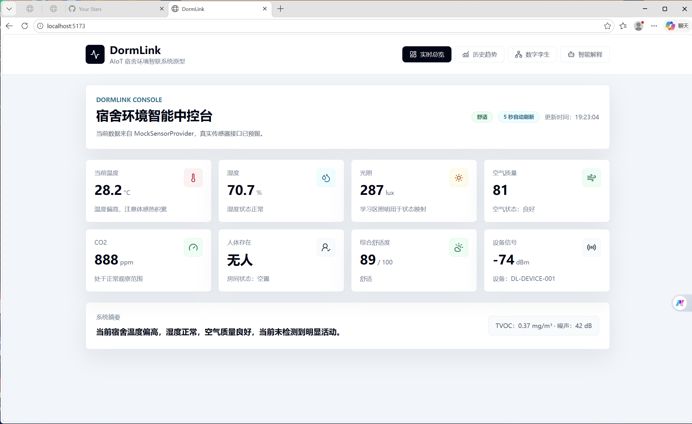

# DormLink

## MQTT Data Source

The backend can subscribe to an MQTT telemetry topic when `MQTT_ENABLED=true`.
Keep real credentials in local environment variables or `backend/.env` only;
`backend/.env` is ignored by git. Do not commit real MQTT passwords.

PowerShell example:

```powershell
cd backend
$env:MQTT_ENABLED="true"
$env:MQTT_HOST="101.132.127.119"
$env:MQTT_PORT="1883"
$env:MQTT_USERNAME="dorm_embedded"
$env:MQTT_PASSWORD="your_password"
$env:MQTT_TOPIC="dormlink/telemetry"
python -m uvicorn app.main:app --reload --port 8000
```

MQTT messages should be JSON objects matching `TelemetryReading`. `timestamp`
is optional; the backend fills the current UTC time when it is missing.

```json
{
  "room_id": "Dorm-A101",
  "device_id": "DL-DEVICE-001",
  "temperature": 25.3,
  "humidity": 62.1,
  "light": 450,
  "air_quality": 38,
  "co2": 680,
  "tvoc": 0.12,
  "motion": true,
  "noise": 35,
  "signal_strength": 24,
  "persons": 2
}
```

After one MQTT message is received, check
`GET /api/v1/telemetry/current`,
`GET /api/v1/telemetry/history?range=1h`, and
`GET /api/v1/telemetry/source`.

DormLink 是一个面向高校宿舍的 AIoT 环境智联系统原型，用于演示从 mock 传感器数据到实时展示、历史趋势、短时预测、数字孪生状态映射、智能解释和用户反馈的完整闭环。

当前阶段不接真实硬件。后端已经通过 `SensorProvider` 抽象预留真实设备数据来源，后续可替换为 HTTP、MQTT 或真实 AIoT 终端上报。




## 项目结构

```text
DormLink/
├── backend/
│   ├── app/
│   │   ├── main.py
│   │   ├── models.py
│   │   ├── mock_data.py
│   │   ├── sensor_provider.py
│   │   ├── services/
│   │   └── routers/
│   ├── requirements.txt
│   └── README.md
├── frontend/
│   ├── src/
│   ├── package.json
│   └── README.md
└── README.md
```

## 后端启动

```bash
cd backend
python -m venv .venv
source .venv/bin/activate  # Windows 可写 .venv\Scripts\activate
pip install -r requirements.txt
uvicorn app.main:app --reload --port 8000
```

健康检查：

```text
http://localhost:8000/api/v1/health
```

## 前端启动

```bash
cd frontend
npm install
npm run dev
```

前端默认请求后端：

```text
http://localhost:8000
```

前端页面默认运行在：

```text
http://localhost:5173
```

## 已实现能力

- Dashboard：实时温度、湿度、光照、空气质量、CO2、人体存在、舒适度和系统摘要
- History：最近 1 小时趋势图、统计卡片和短时风险预测
- DigitalTwin：窗户区域、学习区、床铺区、门口区域的 2D 数字孪生状态
- Assistant：规则版智能解释和人在回路用户反馈提交
- Backend API：健康检查、当前数据、历史数据、上传占位、状态判断、预测、数字孪生、反馈和问答

## 后续接入方向

- 在 `backend/app/sensor_provider.py` 中新增 `RealSensorProvider`、`MQTTSensorProvider` 或 `HTTPSensorProvider`
- 将 `/api/v1/telemetry/upload` 对接真实 HTTP 设备上报
- 将 MQTT 消息消费桥接到 `receive_uploaded_telemetry`
- 将 `explanation_service.py` 替换为 RAG + LLM
- 将 `feedback_service.py` 中的反馈用于个性化阈值或策略优化
