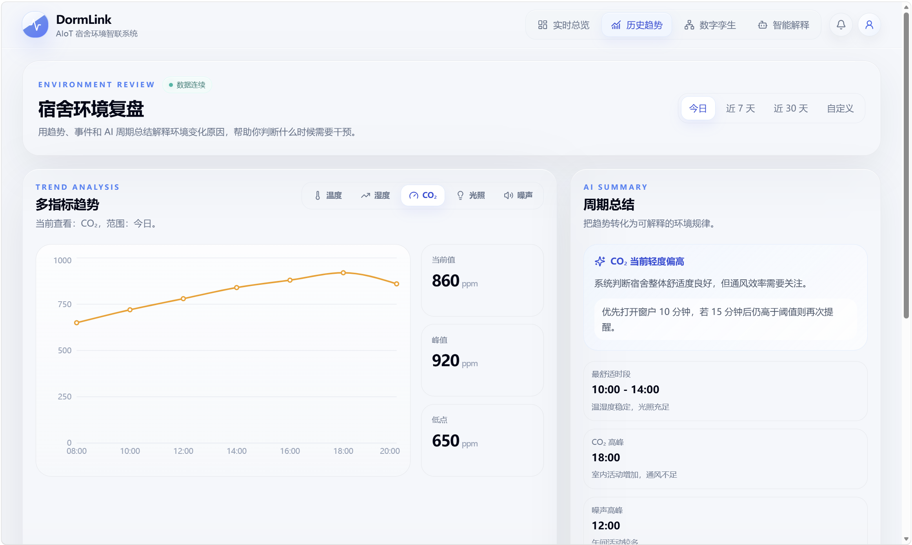
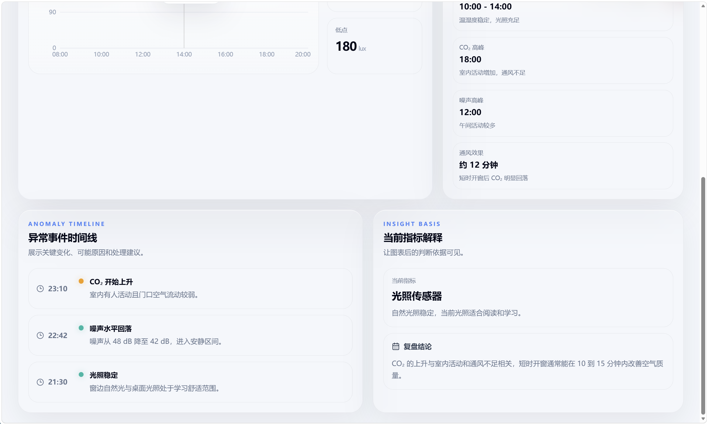
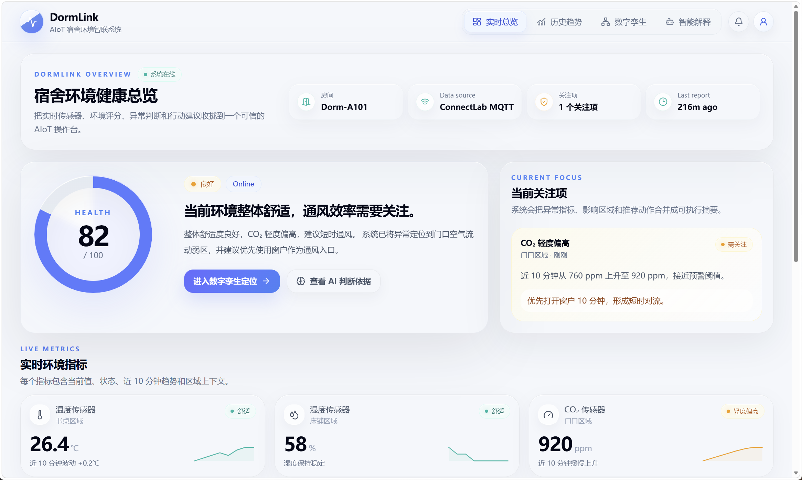
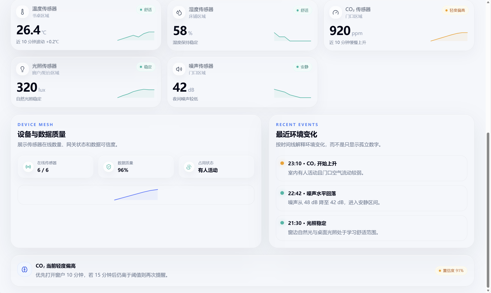
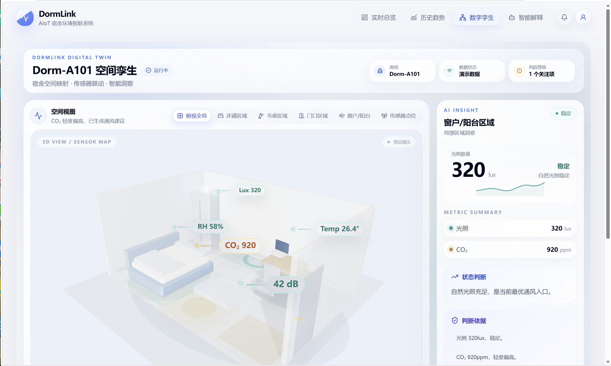
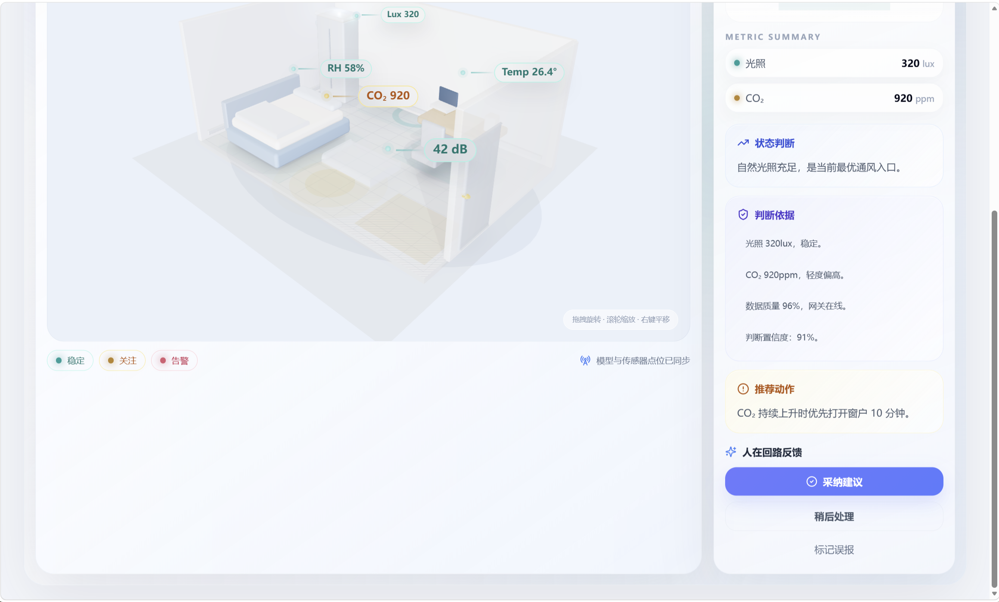
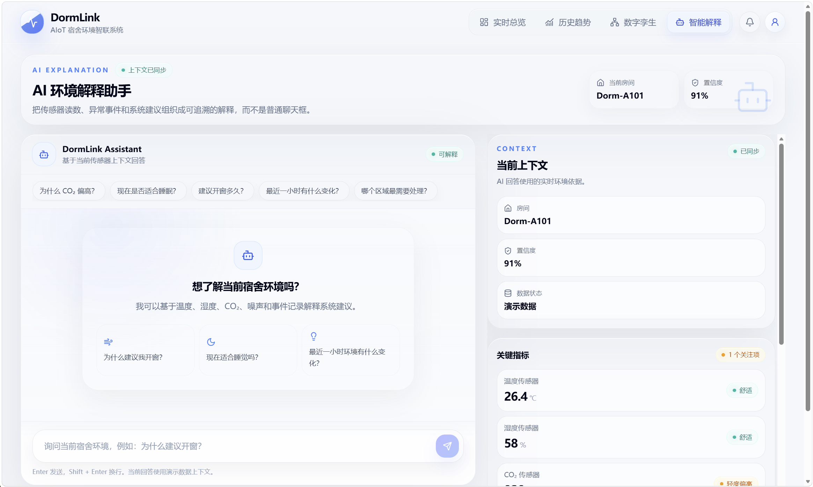

# DormLink

DormLink 是一个面向高校宿舍场景的 AIoT 环境智联系统原型。系统围绕“宿舍环境感知—实时可视化—趋势分析—数字孪生—智能解释—用户反馈”构建完整闭环，既可以在没有真实硬件时通过 Mock 数据完整演示，也可以在开启 MQTT 后接收 ConnectLab 或自建 MQTT Broker 中真实传感器上报的数据。

当前版本已经完成前后端主流程、Mock 数据兜底、MQTT 数据接入、数据源状态展示和真实传感器接入协议预留。后端默认使用 Mock 数据；当 `MQTT_ENABLED=true` 且收到真实设备消息后，系统会优先使用真实数据，并在历史数据不足时自动融合 Mock 数据保证页面可用。

## 1. 系统设计概述

### 1.1 系统目标

DormLink 的核心目标不是单纯展示几个传感器数值，而是把宿舍环境数据转化为可理解、可追踪、可解释、可反馈的智能宿舍状态：

- 对学生：快速知道当前宿舍是否闷热、是否需要通风、是否适合学习或休息。
- 对系统：持续采集环境数据，判断舒适度和风险等级，形成短时趋势预测。
- 对展示：通过 Dashboard、History、Digital Twin 和 Assistant 四个页面形成完整演示链路。
- 对后续扩展：预留真实 ESP32 / 传感器、MQTT Broker、LLM 解释服务和数据库持久化能力。

### 1.2 功能设计

#### 实时总览 Dashboard

实时总览页面负责展示宿舍当前环境状态，是系统的入口页面。页面展示温度、湿度、光照、空气质量、CO2、TVOC、噪声、人体存在、人数估计、舒适度评分等指标，并通过状态卡片给出当前宿舍环境摘要。

该页面还接入了数据源状态显示能力，可以看到当前数据来自 Mock fallback 还是 ConnectLab MQTT / 真实 MQTT 数据，并显示最近一次真实数据上报时间。

#### 历史趋势 History

历史趋势页面负责展示最近一段时间内宿舍环境指标的变化情况。系统当前支持通过 `range` 参数查询不同时间范围内的历史数据，例如 `30min`、`1h`、`2h`。页面通过折线图和统计卡片帮助用户观察环境变化趋势，例如温度是否上升、CO2 是否持续升高、空气质量是否恶化。

该页面同时服务于后端预测模块，后端会基于最近 1 小时历史数据计算温度、湿度和空气质量趋势。

#### 数字孪生 Digital Twin

数字孪生页面把宿舍拆分为窗户区域、学习区、床铺区和门口区域，并把环境状态映射到具体区域。例如空气质量变差时，窗户区域会提示需要通风；学习区光照不足时会提示打开照明；温度偏高时床铺区域会显示热舒适风险。

前端使用 Three.js、React Three Fiber 和 Drei 构建宿舍空间展示，并提供模型加载失败时的 fallback 宿舍模型，保证演示稳定性。

#### 智能解释 Assistant

智能解释页面提供规则版环境问答能力。用户可以询问“为什么宿舍有点闷”“现在适不适合学习”“需要通风吗”等问题，系统会结合当前环境状态生成解释和建议。

该页面还支持用户反馈提交，用于形成“系统判断—用户反馈—后续优化”的人在回路闭环。当前反馈保存到后端本地文件，后续可以接入数据库或用于个性化阈值调整。

#### 数据接入 Telemetry

系统支持两类数据来源：

1. Mock 数据：用于无硬件时的开发、演示和页面兜底。
2. 真实数据：通过 HTTP `/api/v1/telemetry/upload` 或 MQTT Topic 上报。

真实数据进入后端后会被统一转换为 `TelemetryReading` 模型，并交给 `HybridSensorProvider` 管理。业务层不需要关心数据来自 Mock、HTTP 还是 MQTT。

### 1.3 技术架构设计

DormLink 采用前后端分离架构，整体分为四层：

```text
真实传感器 / Mock 数据
        ↓
数据接入层：HTTP Upload / MQTT Bridge / Mock Provider
        ↓
后端服务层：Telemetry / Prediction / Twin / Explanation / Feedback
        ↓
前端展示层：Dashboard / History / Digital Twin / Assistant
```

#### 前端技术设计

前端基于 React + Vite + TypeScript 构建，使用 Tailwind CSS 实现界面样式，使用 Recharts 绘制历史趋势图，使用 Three.js 相关生态实现数字孪生页面。

主要技术点：

- React 负责组件化页面开发。
- Vite 负责本地开发和构建。
- TypeScript 统一前端类型约束。
- Tailwind CSS 实现响应式布局和玻璃态 UI 风格。
- Recharts 展示历史趋势折线图。
- Three.js、@react-three/fiber、@react-three/drei 实现宿舍三维场景。
- `src/api/client.ts` 统一封装后端 API 请求。
- `src/types.ts` 维护前后端共享响应结构。

#### 后端技术设计

后端基于 FastAPI 构建，使用 Pydantic v2 定义数据模型，使用 paho-mqtt 接入 MQTT Broker，使用 python-dotenv 支持本地 `.env` 配置。

主要技术点：

- FastAPI 提供 REST API。
- Pydantic 负责请求和响应数据校验。
- CORS 中间件支持本地前后端跨域调试。
- lifespan 生命周期中自动启动和关闭 MQTT Bridge。
- `SensorProvider` 抽象统一 Mock、HTTP、MQTT 数据来源。
- `HybridSensorProvider` 实现真实数据优先、Mock 数据兜底。
- 服务层负责环境状态判断、短时预测、数字孪生映射和智能解释。
- 路由层只处理 HTTP 输入输出，降低业务逻辑耦合。

#### MQTT 接入设计

MQTT Bridge 位于 `backend/app/mqtt_bridge.py`，负责连接 Broker、订阅 Topic、解析 JSON Payload，并把数据写入统一遥测数据层。

当前设计要点：

- 通过 `MQTT_ENABLED` 控制是否启用 MQTT。
- 通过 `MQTT_HOST`、`MQTT_PORT`、`MQTT_TLS`、`MQTT_USERNAME`、`MQTT_PASSWORD` 配置 Broker。
- 通过 `MQTT_TOPIC` 配置订阅主题，默认是 `dormlink/telemetry`。
- 支持 `MQTT_CLIENT_ID` 手动配置。
- 未配置 `MQTT_CLIENT_ID` 时，后端自动生成唯一 client id，避免多人联调或重复启动时互相顶号。
- 后端启动时自动 `loop_start()`，关闭时自动 `loop_stop()` 和 `disconnect()`。
- MQTT 消息必须是 JSON 对象，且字段符合 `TelemetryReading` 模型。
- `timestamp` 可选，缺失时后端自动补当前 UTC 时间。

#### 数据模型设计

核心遥测模型为 `TelemetryReading`：

```json
{
  "room_id": "Dorm-A101",
  "device_id": "DL-DEVICE-001",
  "timestamp": "2026-06-07T01:00:00Z",
  "temperature": 25.3,
  "humidity": 62.1,
  "light": 450,
  "air_quality": 38,
  "co2": 680,
  "tvoc": 0.12,
  "motion": true,
  "noise": 35,
  "signal_strength": -55,
  "persons": 2
}
```

字段含义：

| 字段 | 含义 | 示例 |
|---|---|---|
| `room_id` | 宿舍或房间编号 | `Dorm-A101` |
| `device_id` | 设备编号 | `ESP32-001` |
| `timestamp` | 数据采集时间，可选 | `2026-06-07T01:00:00Z` |
| `temperature` | 温度 | `25.3` |
| `humidity` | 湿度 | `62.1` |
| `light` | 光照强度 | `450` |
| `air_quality` | 空气质量风险值，当前按 0-100 处理 | `38` |
| `co2` | CO2 浓度，建议单位 ppm | `680` |
| `tvoc` | TVOC 指标 | `0.12` |
| `motion` | 是否检测到人体活动 | `true` |
| `noise` | 噪声指标 | `35` |
| `signal_strength` | 信号强度，例如 Wi-Fi RSSI | `-55` |
| `persons` | 人数估计，后端限制在 0-5 | `2` |

## 2. 技术栈

### Backend

- Python
- FastAPI
- Pydantic v2
- Uvicorn
- paho-mqtt
- python-dotenv

### Frontend

- React
- Vite
- TypeScript
- Tailwind CSS
- Recharts
- Three.js
- @react-three/fiber
- @react-three/drei
- lucide-react

## 3. 项目结构

```text
DormLink/
├── backend/
│   ├── app/
│   │   ├── main.py                     # FastAPI 入口，注册路由和生命周期
│   │   ├── config.py                   # 环境变量配置，包括 MQTT 配置
│   │   ├── models.py                   # API 请求 / 响应模型
│   │   ├── mock_data.py                # Mock 基准数据和区域定义
│   │   ├── sensor_provider.py          # Mock + Hybrid 数据源抽象
│   │   ├── mqtt_bridge.py              # MQTT 订阅桥接
│   │   ├── routers/
│   │   │   ├── telemetry.py            # 遥测数据接口
│   │   │   ├── prediction.py           # 短时预测接口
│   │   │   ├── twin.py                 # 数字孪生接口
│   │   │   ├── feedback.py             # 用户反馈接口
│   │   │   └── chat.py                 # 智能解释接口
│   │   └── services/
│   │       ├── telemetry_service.py    # 环境状态判断和数据转换
│   │       ├── prediction_service.py   # 规则版短时趋势预测
│   │       ├── twin_service.py         # 数字孪生状态映射
│   │       ├── feedback_service.py     # 用户反馈保存
│   │       └── explanation_service.py  # 规则版智能解释
│   ├── .env.example                    # 环境变量模板
│   ├── requirements.txt
│   └── README.md
├── frontend/
│   ├── src/
│   │   ├── api/client.ts               # 前端 API 封装
│   │   ├── pages/                      # Dashboard / History / DigitalTwin / Assistant
│   │   ├── components/                 # 页面组件和 UI 组件
│   │   ├── types.ts                    # 前端 API 类型
│   │   └── main.tsx
│   ├── package.json
│   └── README.md
├── displays/                           # 项目展示截图
└── README.md
```

## 4. 快速启动

### 4.1 启动后端

```bash
cd backend
python -m venv .venv
source .venv/bin/activate
pip install -r requirements.txt
uvicorn app.main:app --reload --port 8000
```

Windows PowerShell：

```powershell
cd backend
python -m venv .venv
.\.venv\Scripts\Activate.ps1
pip install -r requirements.txt
python -m uvicorn app.main:app --reload --port 8000
```

后端默认运行在：

```text
http://localhost:8000
```

健康检查：

```text
GET http://localhost:8000/api/v1/health
```

正常返回示例：

```json
{
  "status": "ok",
  "project": "DormLink",
  "message": "DormLink backend is running"
}
```

### 4.2 启动前端

```bash
cd frontend
npm install
npm run dev
```

前端默认运行在：

```text
http://localhost:5173
```

前端默认请求后端：

```text
http://localhost:8000
```

如需修改后端地址：

```bash
VITE_API_BASE_URL=http://localhost:8000 npm run dev
```

Windows PowerShell：

```powershell
$env:VITE_API_BASE_URL="http://localhost:8000"
npm run dev
```

## 5. 环境变量配置

后端支持从系统环境变量或 `backend/.env` 读取配置。真实账号、密码、Token 不要提交到 Git 仓库。

可以复制模板：

```bash
cd backend
cp .env.example .env
```

`.env.example`：

```dotenv
MQTT_ENABLED=false
MQTT_HOST=
MQTT_PORT=1883
MQTT_TLS=false
MQTT_USERNAME=
MQTT_PASSWORD=your_password
MQTT_CLIENT_ID=
MQTT_TOPIC=dormlink/telemetry
```

字段说明：

| 字段 | 说明 |
|---|---|
| `MQTT_ENABLED` | 是否启用 MQTT，设为 `true` 后后端启动时会连接 Broker |
| `MQTT_HOST` | MQTT Broker 地址，可以是 ConnectLab 地址或自建服务器公网 IP |
| `MQTT_PORT` | MQTT 端口，非 TLS 通常为 `1883`，TLS 通常为 `8883` |
| `MQTT_TLS` | 是否启用 TLS / SSL |
| `MQTT_USERNAME` | MQTT 用户名 |
| `MQTT_PASSWORD` | MQTT 密码或 Token |
| `MQTT_CLIENT_ID` | 可选，留空时后端自动生成唯一 client id |
| `MQTT_TOPIC` | 设备上报 Topic，默认 `dormlink/telemetry` |
| `REAL_HISTORY_LIMIT` | 可选，真实历史数据在内存中保留的最大条数，默认 `3000` |

## 6. Mock 模式

不配置 MQTT 时，系统默认运行在 Mock 模式：

```dotenv
MQTT_ENABLED=false
```

此时后端会自动生成模拟传感器数据，前端所有页面仍然可以正常展示，适合课堂演示、前端开发和无硬件联调。

数据源接口返回类似：

```json
{
  "mode": "mock",
  "topic": "dormlink/telemetry",
  "has_real_data": false,
  "last_seen": null,
  "fallback": true
}
```

## 7. MQTT 模式

### 7.1 PowerShell 临时启动示例

```powershell
cd backend
$env:MQTT_ENABLED="true"
$env:MQTT_HOST="your_mqtt_host"
$env:MQTT_PORT="1883"
$env:MQTT_TLS="false"
$env:MQTT_USERNAME="your_username"
$env:MQTT_PASSWORD="your_password"
$env:MQTT_CLIENT_ID=""
$env:MQTT_TOPIC="dormlink/telemetry"
python -m uvicorn app.main:app --reload --port 8000
```

### 7.2 `.env` 启动示例

在 `backend/.env` 中写入：

```dotenv
MQTT_ENABLED=true
MQTT_HOST=your_mqtt_host
MQTT_PORT=1883
MQTT_TLS=false
MQTT_USERNAME=your_username
MQTT_PASSWORD=your_password
MQTT_CLIENT_ID=
MQTT_TOPIC=dormlink/telemetry
```

然后启动：

```bash
cd backend
uvicorn app.main:app --reload --port 8000
```

### 7.3 后端日志判断

启动成功后，日志中应能看到类似信息：

```text
MQTT connecting host=your_mqtt_host port=1883 topic=dormlink/telemetry client_id=dormlink-backend-xxxx-xxxxxxxx
MQTT connected client_id=dormlink-backend-xxxx-xxxxxxxx
MQTT subscribed topic=dormlink/telemetry result=0 mid=1
```

收到设备消息后，应能看到：

```text
MQTT message received topic=dormlink/telemetry bytes=...
MQTT telemetry stored room_id=Dorm-A101 device_id=DL-DEVICE-001 timestamp=...
```

## 8. 真实传感器接入协议

硬件端或 ESP32 传感器端只需要满足下面约定：

1. 连接同一个 MQTT Broker。
2. 使用项目约定 Topic：`dormlink/telemetry`。
3. 每隔固定时间发布一条 JSON 对象。
4. JSON 字段名和类型与 `TelemetryReading` 保持一致。
5. 不要和后端使用同一个 `client_id`。
6. `timestamp` 可以不传，后端会自动补当前 UTC 时间。

推荐 Payload：

```json
{
  "room_id": "Dorm-A101",
  "device_id": "ESP32-001",
  "temperature": 25.3,
  "humidity": 62.1,
  "light": 450,
  "air_quality": 38,
  "co2": 680,
  "tvoc": 0.12,
  "motion": true,
  "noise": 35,
  "signal_strength": -55,
  "persons": 2
}
```

可以直接发给硬件队友的对接说明：

```text
后端 MQTT 通路已经接好了。你这边只需要把传感器数据发布到同一个 MQTT Broker 的 dormlink/telemetry Topic。

请按 JSON 对象发布，字段如下：
room_id, device_id, temperature, humidity, light, air_quality, co2, tvoc, motion, noise, signal_strength, persons。

timestamp 可以不传，后端会自动补当前时间。

示例：
{
  "room_id": "Dorm-A101",
  "device_id": "ESP32-001",
  "temperature": 25.3,
  "humidity": 62.1,
  "light": 450,
  "air_quality": 38,
  "co2": 680,
  "tvoc": 0.12,
  "motion": true,
  "noise": 35,
  "signal_strength": -55,
  "persons": 2
}

注意：你的设备 client_id 不要和后端重复。后端现在会自动生成自己的 client_id。你可以用 ESP32-001 或 dormlink-esp32-001。
```

## 9. MQTT 本地发布测试

如果本机安装了 Mosquitto 客户端，可以用下面命令模拟传感器上报。

无账号密码：

```bash
mosquitto_pub \
  -h your_mqtt_host \
  -p 1883 \
  -t dormlink/telemetry \
  -m '{"room_id":"Dorm-A101","device_id":"DL-DEVICE-001","temperature":25.3,"humidity":62.1,"light":450,"air_quality":38,"co2":680,"tvoc":0.12,"motion":true,"noise":35,"signal_strength":-55,"persons":2}'
```

有账号密码：

```bash
mosquitto_pub \
  -h your_mqtt_host \
  -p 1883 \
  -u your_username \
  -P your_password \
  -t dormlink/telemetry \
  -m '{"room_id":"Dorm-A101","device_id":"DL-DEVICE-001","temperature":25.3,"humidity":62.1,"light":450,"air_quality":38,"co2":680,"tvoc":0.12,"motion":true,"noise":35,"signal_strength":-55,"persons":2}'
```

Windows PowerShell：

```powershell
$payload = '{"room_id":"Dorm-A101","device_id":"DL-DEVICE-001","temperature":25.3,"humidity":62.1,"light":450,"air_quality":38,"co2":680,"tvoc":0.12,"motion":true,"noise":35,"signal_strength":-55,"persons":2}'
mosquitto_pub -h your_mqtt_host -p 1883 -u your_username -P your_password -t dormlink/telemetry -m $payload
```

## 10. HTTP 上报测试

除了 MQTT，后端也保留了 HTTP 上报接口，方便设备或调试脚本直接写入数据。

```bash
curl -X POST "http://localhost:8000/api/v1/telemetry/upload" \
  -H "Content-Type: application/json" \
  -d '{
    "room_id": "Dorm-A101",
    "device_id": "DL-DEVICE-001",
    "temperature": 25.3,
    "humidity": 62.1,
    "light": 450,
    "air_quality": 38,
    "co2": 680,
    "tvoc": 0.12,
    "motion": true,
    "noise": 35,
    "signal_strength": -55,
    "persons": 2
  }'
```

正常返回：

```json
{
  "success": true,
  "message": "Telemetry received and stored."
}
```

## 11. 后端 API

| 方法 | 路径 | 说明 |
|---|---|---|
| `GET` | `/api/v1/health` | 后端健康检查 |
| `GET` | `/api/v1/telemetry/current` | 获取当前最新遥测数据 |
| `GET` | `/api/v1/telemetry/history?range=1h` | 获取历史趋势数据，支持 `30min`、`1h`、`2h` 等格式 |
| `POST` | `/api/v1/telemetry/upload` | HTTP 方式上传遥测数据 |
| `GET` | `/api/v1/telemetry/state` | 获取环境状态、舒适度和摘要 |
| `GET` | `/api/v1/telemetry/source` | 获取当前数据源、Topic、最近真实数据时间和 fallback 状态 |
| `GET` | `/api/v1/prediction/short-term?horizon=30min` | 获取短时趋势预测和风险摘要 |
| `GET` | `/api/v1/twin/state` | 获取数字孪生区域状态和建议动作 |
| `POST` | `/api/v1/feedback` | 提交用户反馈 |
| `POST` | `/api/v1/chat/ask` | 获取规则版智能解释回答 |

## 12. 联调验证流程

前后端和 MQTT Broker 都启动后，按下面顺序检查：

1. 打开后端健康检查。

```text
GET http://localhost:8000/api/v1/health
```

2. 查看当前数据源状态。

```text
GET http://localhost:8000/api/v1/telemetry/source
```

3. 发布一条 MQTT 测试数据到 `dormlink/telemetry`。

4. 查看当前最新数据。

```text
GET http://localhost:8000/api/v1/telemetry/current
```

5. 查看历史数据中是否出现真实数据。

```text
GET http://localhost:8000/api/v1/telemetry/history?range=1h
```

6. 查看环境状态判断。

```text
GET http://localhost:8000/api/v1/telemetry/state
```

7. 打开前端页面。

```text
http://localhost:5173
```

8. 在实时总览页面确认 Data source 由 `Mock fallback` 变为 `ConnectLab MQTT`，并确认 Last real update 出现最近上报时间。

## 13. 当前实现进度

### 已完成

- 前端四个主要页面：Dashboard、History、Digital Twin、Assistant。
- 后端 FastAPI 接口层和服务层。
- Mock 传感器数据生成和历史趋势数据生成。
- 环境状态判断：温度、湿度、空气质量、光照、人体存在、舒适度评分。
- 短时预测：温度趋势、湿度趋势、空气质量趋势和风险摘要。
- 数字孪生状态映射：窗户、学习区、床铺区、门口区域。
- 规则版智能解释和用户反馈提交。
- HTTP 遥测数据上报接口。
- MQTT Bridge：连接 Broker、订阅 Topic、解析 JSON、写入传感器数据层。
- MQTT client id 自动生成，避免固定 client id 导致连接冲突。
- 后端 lifespan 中自动启动和关闭 MQTT Bridge。
- `/api/v1/telemetry/source` 数据源状态接口。
- 前端 Dashboard 数据源状态展示。

### 正在推进

- 接入真实 ESP32 / 传感器端。
- 与队友统一传感器字段单位和采样频率。
- 使用 ConnectLab 或自建 MQTT Broker 完成端到端真实数据流。

### 后续计划

- 增加设备离线判断和异常 Payload 统计。
- 将反馈数据用于个性化阈值调整。
- 将规则版解释服务替换为 RAG + LLM。
- 将数字孪生从规则映射升级为更细粒度的区域状态推理。
- 增加数据库持久化，替代当前内存历史和本地 JSON 反馈文件。
- 增加部署脚本，用于云服务器一键运行后端、前端和 MQTT Broker。

## 14. 实现细节说明

### 14.1 数据源抽象

`backend/app/sensor_provider.py` 定义统一数据源协议：

- `BaseSensorProvider`：约束任意数据源必须实现当前数据、历史数据、数据写入和数据源状态查询。
- `MockSensorProvider`：生成模拟宿舍传感器数据。
- `HybridSensorProvider`：优先使用真实数据，真实历史数据不足时自动融合 Mock 数据。

这样路由层和服务层不需要关心数据来自 Mock、HTTP 还是 MQTT，只需要调用统一的 `sensor_provider`。

### 14.2 MQTT Bridge

`backend/app/mqtt_bridge.py` 负责 MQTT 接入：

- `start_mqtt_bridge()`：后端启动时执行，读取配置并连接 Broker。
- `stop_mqtt_bridge()`：后端关闭时执行，停止 loop 并断开连接。
- `_on_connect()`：连接成功后订阅 `MQTT_TOPIC`。
- `_on_message()`：解析 JSON 消息，构造 `TelemetryReading`，调用 `receive_uploaded_telemetry()` 写入数据层。
- `_resolve_client_id()`：优先使用环境变量中的 `MQTT_CLIENT_ID`，未配置时自动生成唯一 id。

### 14.3 环境状态判断

`backend/app/services/telemetry_service.py` 根据当前传感器数据计算环境状态：

- 温度状态：`cold`、`cool`、`normal`、`hot`。
- 湿度状态：`dry`、`normal`、`humid`。
- 空气状态：`good`、`moderate`、`poor`。
- 光照状态：`dim`、`normal`、`bright`。
- 人体存在状态：`occupied`、`vacant`。
- 舒适度等级：`comfortable`、`acceptable`、`slightly_uncomfortable`、`uncomfortable`。

### 14.4 短时预测

`backend/app/services/prediction_service.py` 使用最近 1 小时历史数据进行规则版趋势预测。当前版本不是机器学习模型，而是通过前后窗口均值差判断指标趋势，适合课程项目原型演示。

### 14.5 数字孪生映射

`backend/app/services/twin_service.py` 把环境状态映射到宿舍区域：

- 空气质量中等或较差：窗户区域提示通风。
- 光照偏暗：学习区提示低光照。
- 温度偏高：床铺区域提示偏热。
- 检测到人体活动：门口区域显示活动状态。

## 15. 项目展示

> 注意：下列图片路径严格匹配 `displays` 目录中的图片名。

### 历史趋势





### 实时总览





### 数字孪生





### 智能解释



## 16. 常见问题

### 16.1 前端页面能打开，但一直是 Mock fallback

检查：

- `MQTT_ENABLED` 是否为 `true`。
- `MQTT_HOST`、`MQTT_PORT`、用户名、密码是否正确。
- 后端日志是否出现 `MQTT connected`。
- 设备是否真的向 `MQTT_TOPIC` 发布了消息。
- 发布的 JSON 是否能通过后端字段校验。

### 16.2 后端日志出现 MQTT disconnected

检查：

- Broker 是否在线。
- 端口是否开放。
- 用户名密码是否正确。
- 是否多个客户端使用了同一个 client id。
- 云服务器安全组是否允许对应端口。

### 16.3 MQTT 收到消息但 current 没变化

检查：

- Payload 是否是 JSON 对象，而不是字符串或数组。
- 字段名是否完全匹配后端模型。
- `temperature`、`humidity`、`tvoc` 应为数字。
- `light`、`air_quality`、`co2`、`noise`、`signal_strength`、`persons` 应为整数。
- `motion` 应为布尔值 `true` / `false`。

### 16.4 前端请求后端失败

检查：

- 后端是否在 `http://localhost:8000` 运行。
- 前端 `VITE_API_BASE_URL` 是否设置正确。
- 浏览器控制台是否有网络错误。
- 后端 CORS 当前已允许开发环境跨域请求。

## 17. 安全说明

- 不要提交真实 `.env` 文件。
- 不要把真实 MQTT 密码、Token、云服务器密码写进 README。
- README 中只保留占位符，例如 `your_mqtt_host`、`your_username`、`your_password`。
- 如果仓库曾经提交过真实密钥，应立即更换密钥，并清理 Git 历史记录。
